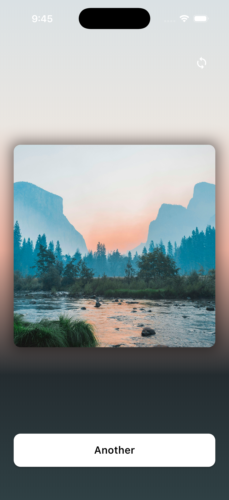
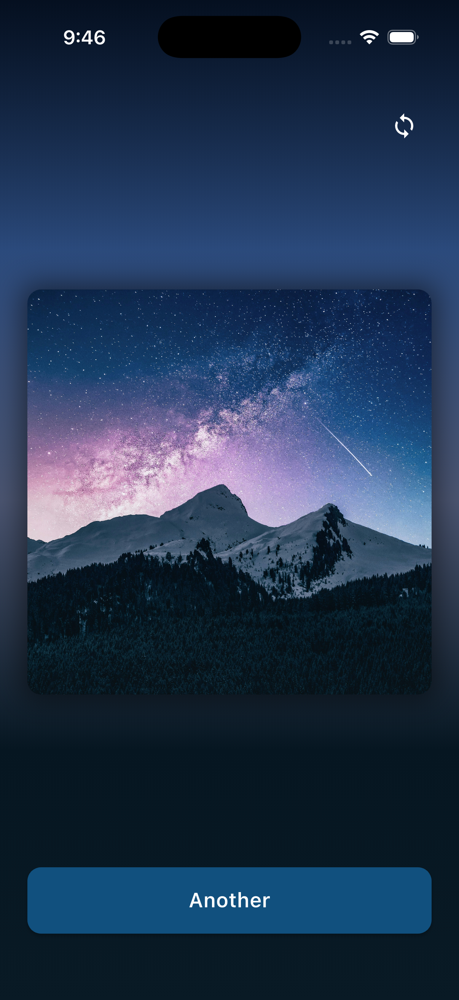
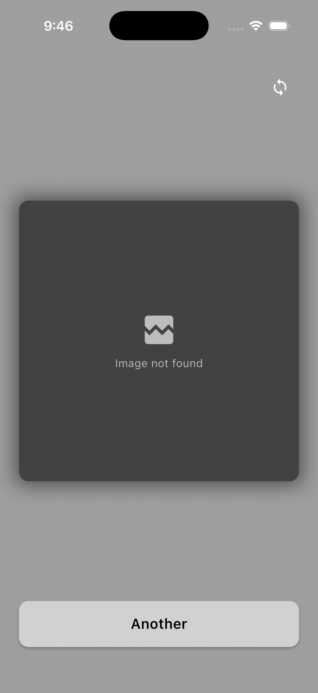
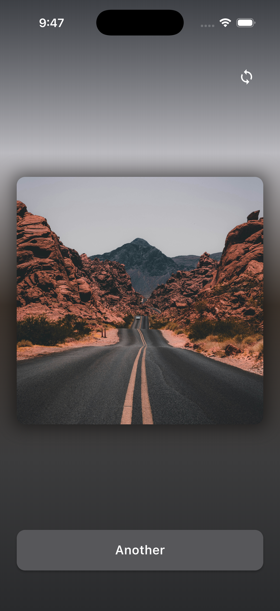
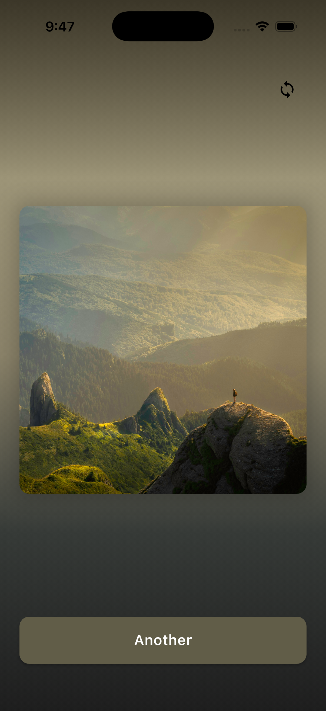

# Aurora Mobile Engineer Take-Home Challenge

A Flutter app that fetches random images from the Aurora API and adapts the background color to the image's dominant tones for an immersive experience.

Built with Flutter + BLoC architecture and optimized for smooth animations, theme awareness, and accessibility.

---

## Goal

Display a random image from Aurora's `/image` endpoint centered as a square, with an adaptive background and a button to fetch another image.

---

Tested on Android & iOS (Flutter 3.3+).

---

## Downloads

### Pre-built APK
Download the latest release APK from GitHub Releases:

**[Download APK (v1.0.0)](https://github.com/vishnu32510/aurora_mobile_challenge/releases/tag/v1.0.0)**

---
## Demo

### iOS Demo
- [Local File](./assets/demo/Demo_IOS.mov)
- [Google Drive](https://drive.google.com/file/d/1L87MSbM1auBgbKrnZvf3EbtqmaF2M7RY/view?usp=sharing)

### Android Demo
- [Local File](./assets/demo/Demo_Android.mp4)
- [Google Drive](https://drive.google.com/file/d/1QPFBWWmadkI1Zbq0DtWbpaogK3quEl03/view?usp=sharing)

## Screenshots

<table>
  <tr>
    <td></td>
    <td></td>
    <td></td>
  </tr>
</table>

<table>
  <tr>
    <td></td>
    <td></td>
  </tr>
</table>

---

## Implemented Features

### Core

* **Random Image Fetching** – Uses Aurora API (`GET /image`) to retrieve new images on tap.

* **Square Image Display** – Maintains perfect 1:1 aspect ratio across orientations.

* **Adaptive Background** – Background color and gradient adapt dynamically using `PaletteGenerator`.

* **Another Button** – Loads a new random image with one tap.

* **Image Caching** – Efficient network caching for repeat views.

### User Experience

* **Smooth Transitions** –

  * Fade-in for images (300 ms)

  * Animated background color transition (800 ms, easeOutCubic)

* **Loading & Error States** –

  * Theme-aware shimmer placeholders

  * Graceful "Image not found" fallback

* **Light / Dark / System Themes** – Fully responsive to system settings.

* **Accessibility** – Semantic labels, proper button roles, and image descriptions.

### Architecture

* **BLoC + Repository Pattern** – Predictable, modular state management.

* **Dependency Injection (GetIt)** – Clean service access and testing setup.

* **Async Color Extraction** – Runs off the main thread for a responsive UI.

* **Custom Widgets & Wrappers** – Reusable theme-aware widgets and shimmer services for consistent UI patterns.

### Future Scalability

Currently, color extraction runs asynchronously via Flutter's background image-decoding threads.

For future expansion (e.g., batch or parallel processing of multiple images), the logic can be moved to a dedicated **Flutter Isolate** to parallelize heavy color analysis.

---

## Project Structure

```
lib/
├── core/
│   ├── di/                # Dependency injection setup
│   ├── repositories/      # Image repository
│   └── services/          # HTTP service layer
├── modules/
│   ├── image/             # Image BLoC (event/state/logic)
│   └── theme/             # Theme BLoC and toggle widget
└── screens/
    └── image_viewer/      # Main UI and widgets
```

---

## Getting Started

```bash
git clone <repository-url>
cd aurora_mobile_challenge
flutter pub get
flutter run
```

---

## Notes

* Built with Material 3 design principles.

* Handles large Unsplash images gracefully.

* Fully async image decoding ensures zero UI jank.

* Future optimization path: migrate color extraction into a persistent Flutter Isolate for multi-image workloads.

---

## Author

Developed by Vishnu Priyan Sellam Shanmugavel

for the **Aurora Mobile Engineer Take-Home Challenge**.
